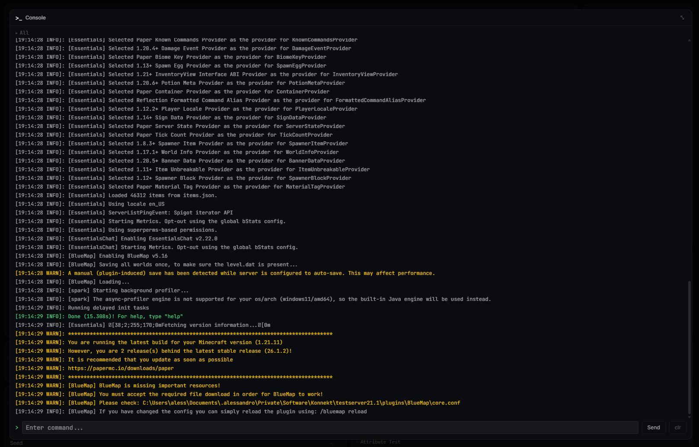
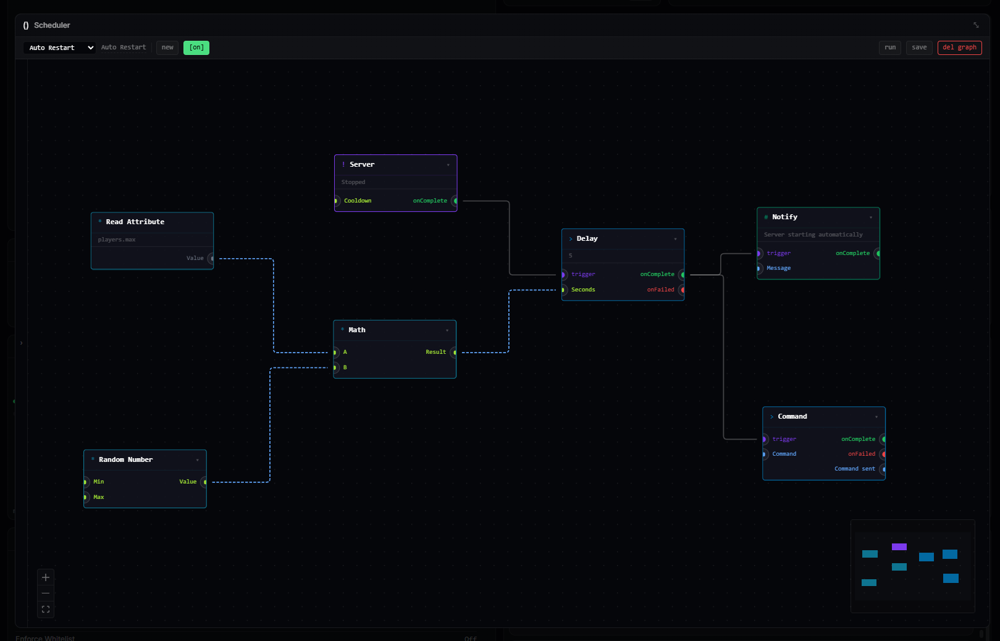
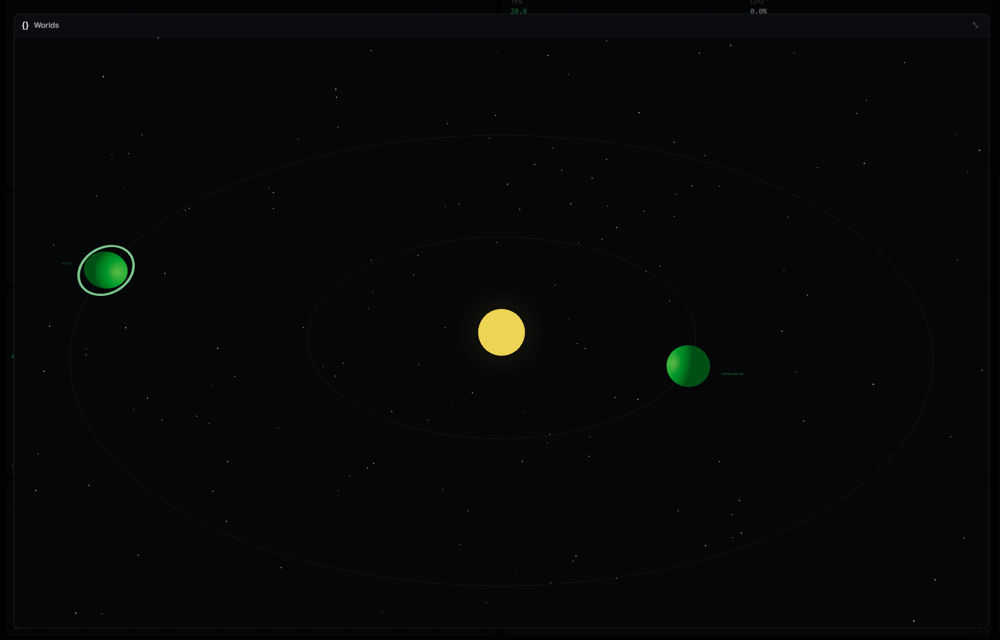
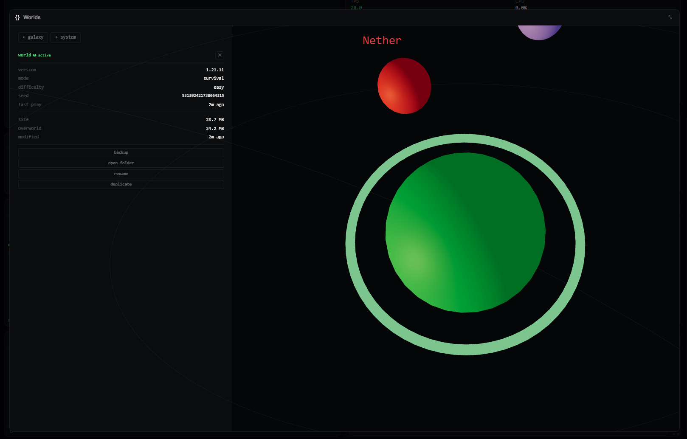
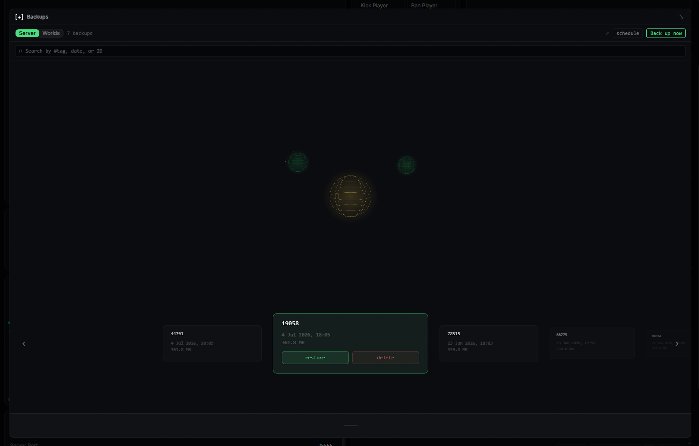
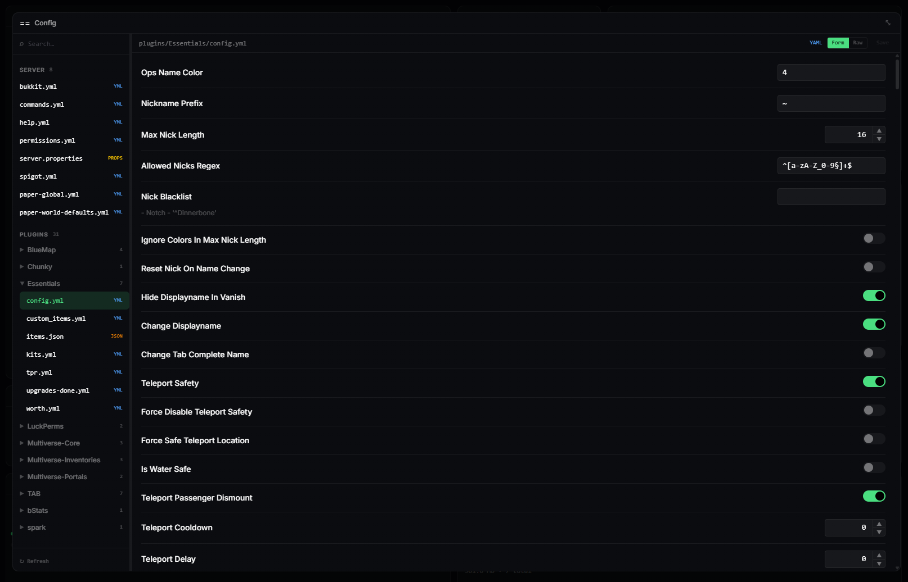
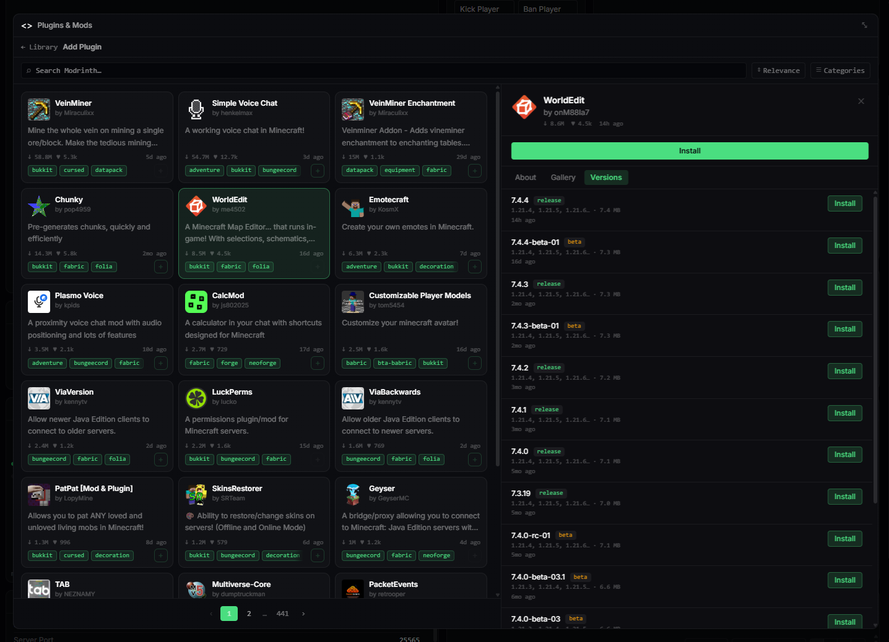
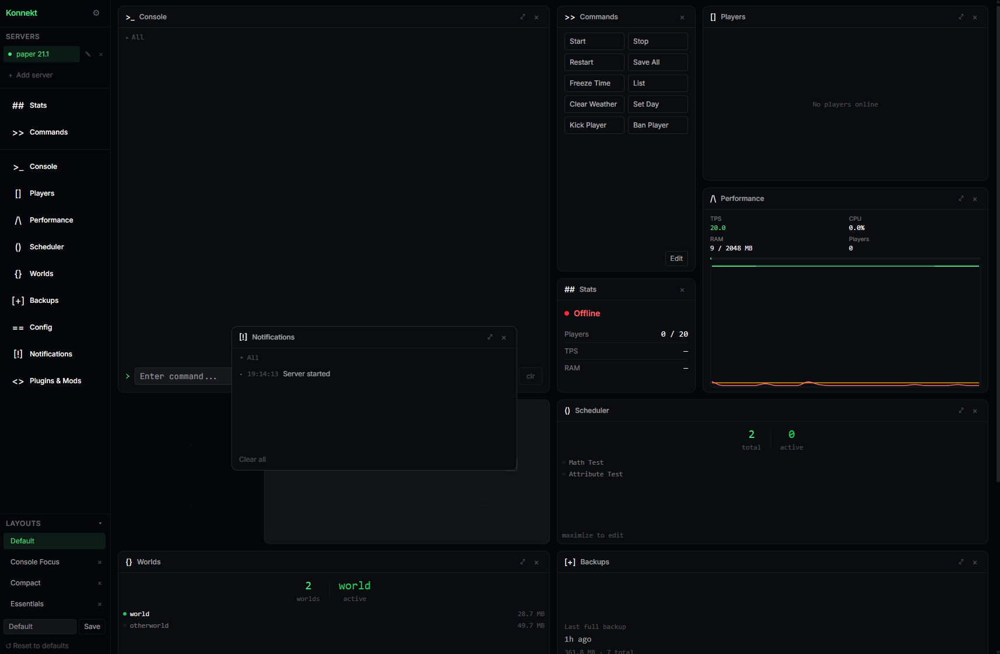

# Konnekt

Konnekt is a cross-platform desktop control panel for self-hosted Minecraft servers. It wraps everything you'd normally do through a raw console, RCON, or SSH — starting servers, watching logs, managing worlds, scheduling backups, installing mods — into a single native app with a modular, drag-and-drop dashboard.

It's built for Minecraft server admins and hobbyists who self-host vanilla, Paper/Spigot/Bukkit, or modded Fabric/Forge servers and want a real GUI instead of stitching together terminal windows and plugins.

> **Status:** Alpha. Core management, scheduling, worlds, backups, and mods are functional; see [Roadmap](#roadmap) for what's still coming.


## Features

### Multi-server management

Add and configure any number of server instances — jar path, JVM arguments, working directory — and start, stop, or restart them independently, with a guided EULA acceptance flow for first-time setup.


### Live console

Stream server logs in real time, send commands directly, and set up your own quick-command buttons for the actions you run most.



### Stats & performance

Keep an eye on TPS, RAM usage, player count, and uptime at a glance, with a rolling performance history chart to spot trends and troubleshoot lag.


### Player management

See who's online and kick, ban, or pardon players without leaving the dashboard.


### Visual scheduler

A node-based automation editor: wire up triggers (a player joining or leaving, the server stopping, TPS dropping below a threshold, a cron/interval/time-of-day schedule) to actions (run a console command, send an RCON command, trigger a backup, make an HTTP request, wait, start/stop/restart the server) and control/data blocks (conditions, math, randomness, server attributes). Runs are tracked with history and next-run predictions.



### World management

A 3D visualizer for navigating your server's worlds and dimensions — switch the active world, rename, duplicate, delete, back up individual worlds, and inspect NBT metadata.




### Backups

Manual or scheduled backups of full servers or individual worlds, with safe restore (validated paths, extract-then-swap), progress feedback, and history.



### Server config editor

Browse and edit `server.properties` and other config files (JSON/YAML/TOML) through a form view or raw text editor.



### Mods & plugins

Browse and search Modrinth from inside the app, resolve dependencies, install or uninstall, enable/disable, check for updates, or install a local jar. Konnekt detects your server's loader (Fabric, Forge, Paper, etc.) automatically.



### Customizable tile dashboard

Every feature lives in a draggable, resizable tile that snaps to a grid. Stash tiles you're not using in the crate, maximize the ones you need, and save named layout presets.



### Notifications

An in-app notification feed plus native OS desktop notifications for crashes, joins/leaves, backup completion, TPS drops, and scheduler events.


## Why Konnekt

- **Local-first.** All app state is stored locally on disk — no account, no cloud dependency, no telemetry required to run your server.
- **Cross-platform.** Built on [Wails](https://wails.io/), so it runs as a native app on Windows, macOS, and Linux.
- **One dashboard, not ten tools.** Console, stats, scheduling, worlds, backups, config, and mods all live in the same window instead of separate scripts and plugins.

## Tech stack

- **Backend:** Go, via [Wails v2](https://wails.io/) for native windowing and Go↔JS bindings
- **Frontend:** React 19, TypeScript, Vite, Tailwind CSS v4
- **State:** Zustand
- **Visual scheduler:** [React Flow](https://reactflow.dev/) on the frontend, a graph execution engine in Go on the backend
- **World visualizer:** three.js / @react-three/fiber
- **Config editing:** CodeMirror

## Getting started

Requires [Go](https://go.dev/), [Node.js](https://nodejs.org/) with [pnpm](https://pnpm.io/), and the [Wails CLI](https://wails.io/docs/gettingstarted/installation).

```bash
# install dependencies
pnpm install

# run in development mode with hot reload
wails dev

# build a production binary
wails build
```

## Roadmap

See [`agent_docs/ROADMAP.md`](agent_docs/ROADMAP.md) for the full scope.

## Documentation

- [`agent_docs/CLAUDE.md`](agent_docs/CLAUDE.md) — architecture and stack overview
- [`agent_docs/ROADMAP.md`](agent_docs/ROADMAP.md) — full feature roadmap
- [`agent_docs/DEPENDENCIES.md`](agent_docs/DEPENDENCIES.md) — dependency notes
- [`agent_docs/HEALTH_CHECKLIST.md`](agent_docs/HEALTH_CHECKLIST.md) — codebase health checklist
